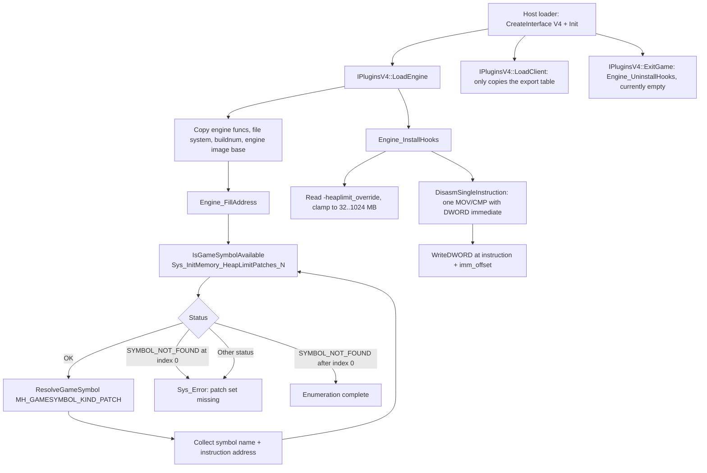

# HeapPatch

HeapPatch is a utility plugin that raises the hard-coded engine heap limit of GoldSrc / SvEngine. It
resolves the gamedata PATCH records numbered `Sys_InitMemory_HeapLimitPatches_0..N`, decodes the
instruction at each resolved address, and rewrites the DWORD immediate operand to a larger byte value
(256 MB by default), mitigating out-of-memory failures caused by the fixed heap cap in `Sys_InitMemory`.

## Provenance

This repository is the standalone HeapPatch plugin, extracted from MetaHookSv
(`Plugins/HeapPatch/`) into its own CMake workspace, aligned with the standalone Renderer,
PrecacheManager and HUDColor projects. This note was migrated from MetaHookSv
`memory/HeapPatch.md` and adapted to the new layout: plugin sources moved to `src/`, the original
`HeapPatch.vcxproj` / `MetaHook.sln` / `scripts/build-Plugins.bat` / `plugins_*.lst` integration was
replaced by CMake plus a self-owned gamedata catalog, and the MetaHookSv `src/metahook.cpp` loader
described in the original note belongs to the host, not to this repository. The `metahooksv` Basic
Memory project belongs to the source repository; notes here use the `heappatch` project and the
`heappatch/` permalink prefix.

## Responsibilities and entry points

- `src/plugins.cpp`: `IPluginsV4` lifecycle. `Init` stores the host API / interface / engine save;
  `LoadEngine` collects the file system (`FileSystem` or `FileSystem_HL25`), engine type/buildnum and
  `g_EngineDLLInfo.ImageBase`, copies `cl_enginefunc_t`, then runs `Engine_FillAddress()` followed by
  `Engine_InstallHooks()`; `LoadClient` only copies the export table; `ExitGame` calls
  `Engine_UninstallHooks()`. The plugin is exported through
  `EXPOSE_SINGLE_INTERFACE(IPluginsV4, IPluginsV4, METAHOOK_PLUGIN_API_VERSION_V4)`.
- `src/privatehook.cpp`: the whole patch pipeline — address resolution, one-instruction decode and
  immediate rewrite.
- `src/privatehook.h`: `Engine_FillAddress` / `Engine_InstallHooks` / `Engine_UninstallHooks` declarations.
- `src/plugins.h`: engine/plugin globals, `MHPluginName "HeapPatch"`, the `Sys_Error` wrapper and the
  signature/search macros retained from MetaHookSv.
- `src/exportfuncs.cpp`, `src/exportfuncs.h`: the shared `cl_enginefunc_t gEngfuncs` instance.
- `src/enginedef.h`: MetaHook include shim.

Key implementation points:

- `Engine_FillAddress` enumerates the patch set through gamedata only: it formats
  `Sys_InitMemory_HeapLimitPatches_%d`, checks `IsGameSymbolAvailable`, and resolves each hit with
  `ResolveGameSymbol(engineBase, name, MH_GAMESYMBOL_KIND_PATCH, &address)`. Index 0 is required; the
  first `MH_GAMESYMBOL_SYMBOL_NOT_FOUND` after it is the enumeration end, while any other status is
  fatal. Every failure path reports symbol, module, engine buildnum, CRC64 and the status string
  through `Sys_Error`.
- `FindHeapLimitImmediate` decodes exactly one instruction with `DisasmSingleInstruction` and accepts
  only `MOV` / `CMP` whose second operand is a DWORD immediate (`imm_size == sizeof(DWORD)` and the
  immediate fits inside the instruction length). The written address is `instruction + imm_offset` —
  the PATCH address is the instruction address, not the immediate address.
- `Engine_InstallHooks` starts from a 256 MB default, reads `-heaplimit_override` through
  `CheckParm`, clamps it to `[32, 1024]` MB, and writes the same byte value to every collected site
  with `WriteDWORD`.
- `Engine_UninstallHooks` is empty: the writes are a one-time patch and the original immediates are
  not restored at shutdown.
- `src/privatehook.cpp` starts with `static_assert(METAHOOK_API_VERSION >= 110, ...)` because
  `IsGameSymbolAvailable` and the PATCH symbol kind require MetaHook API 110.

## Architecture

## Dependencies

- **MetaHook API** (>= 110, enforced by a `static_assert` in `src/privatehook.cpp`):
  `IsGameSymbolAvailable`, `ResolveGameSymbol` with `MH_GAMESYMBOL_KIND_PATCH`,
  `GetModuleCRC64`, `GetGameSymbolStatusString`, `DisasmSingleInstruction`, `WriteDWORD`,
  `GetEngineType`, `GetEngineBuildnum`, `GetEngineBase`, `SysError`.
- **Capstone headers**: consumed for instruction-level parsing (`cs_insn`, `X86_INS_MOV` /
  `X86_INS_CMP`, `x86.encoding`). HeapPatch uses Capstone through the MetaHook API and does not link
  Capstone; `CAPSTONE_LIBRARY_DIRS` is explicitly ignored.
- **Engine export table**: `cl_enginefunc_t` (`CheckParm`) from the MetaHook SDK.
- **MetaHook SDK headers and `include/HLSDK/common/interface.cpp`**: compiled into the plugin because
  `EXPOSE_SINGLE_INTERFACE` (which exports `CreateInterface`) lives there.
- **Build-only inputs**: MetaHook source tree (read-only) and VC-LTL 5.3.1. No third-party library is
  linked.
- **Runtime configuration**: `HeapPatch.dll` is listed in the host's `metahook/configs/plugins.lst`,
  and the shipped `metahook/gamedata/heappatch` catalog must stay next to it.

## Repository layout

- `src/plugins.cpp`, `src/plugins.h` — plugin lifecycle, host API and shared globals.
- `src/privatehook.cpp`, `src/privatehook.h` — gamedata resolution, instruction decode, immediate rewrite.
- `src/exportfuncs.cpp`, `src/exportfuncs.h`, `src/enginedef.h` — shared engine function table and includes.
- `CMakeLists.txt`, `cmake/Sources.cmake` (explicit compile list), `cmake/Dependencies.cmake`,
  `cmake/VCLTL.cmake` — build.
- `scripts/build-HeapPatch-x86-{Debug,Release}.bat` — configure/build/install entry points.
- `scripts/manifests/heappatch.json`, `scripts/sync-gamedata.py`, `scripts/validate-gamedata.py` —
  gamedata synchronization and validation.
- `README.md` — install, launch option and build documentation. There is no Chinese README, no
  `docs/` directory and no test suite.
- `.github/workflows/livebuild.yml`, `.github/workflows/release.yml` — CI.

## Build and data flow

`scripts/build-HeapPatch-x86-{Debug,Release}.bat` → CMake (Visual Studio 17 2022, `-A Win32`) →
compile the DLL → install. The build uses MSVC x86, a static CRT and VC-LTL 5.3.1 with the explicit
compile list in `cmake/Sources.cmake`; Debug compiles at `/W0`, Release at `/W3` with the SDK's known
warnings suppressed, and Release enables interprocedural optimization.
`scripts/manifests/heappatch.json` → `scripts/sync-gamedata.py` → pruned catalog under
`build/x86/<Configuration>/assets/svencoop/metahook/gamedata/heappatch`, validated by
`scripts/validate-gamedata.py` before the plugin target builds; disable with
`-DHEAPPATCH_SYNC_GAMEDATA=OFF`.
The manifest declares the single symbol `engine` / `Sys_InitMemory_HeapLimitPatches_0` as a `patch`
record plus a `numberedPatchSets` entry with prefix `Sys_InitMemory_HeapLimitPatches`, which is what
makes the synchronizer publish the whole numbered family for each listed game version
(`cof-5936`, `hl-10210`, `hl-3248`, `hl-3266`, `hl-3329`, `hl-3647`, `hl-4554`, `hl-6153`,
`hl-8684`, `svencoop-10257`, `svencoop-8948`). Catalog coverage is not a validation statement.
Install output is `install/x86/<Configuration>/svencoop/metahook/{plugins,gamedata/heappatch}` (DLL
plus PDB); nothing is deployed into the game automatically.

## Notes

- The plugin never hard-codes the number of patch sites: it walks indices until the first gap, so the
  upstream catalog decides how many immediates are rewritten.
- Patch sites come entirely from gamedata. Disassembly is used only to locate the immediate field
  inside an already-resolved instruction — there is no signature search, no fixed-offset shortcut and
  no old-immediate matching. A decode failure or an unexpected instruction layout reports the PATCH
  symbol and address and aborts instead of looking for a replacement.
- A missing index-0 record is fatal, not a silent no-op: `Failed to resolve
  "Sys_InitMemory_HeapLimitPatches_0"` with CRC64, buildnum and status.
- `-heaplimit_override` is measured in MB and forcibly constrained to `32..1024`; out-of-range values
  are clamped, and an absent or empty value keeps the 256 MB default.
- Every resolved site receives the same override value, regardless of its original immediate and
  regardless of engine type; the migrated note records that Cry of Fear (`cof-5936`) ships six
  heap-limit sites (one 40 MB, five 128 MB) and the `hl-3248`..`hl-4554` blobs four each, but neither
  the counts nor the values are encoded in this repository.
- Because `Engine_UninstallHooks` is empty, `ExitGame` does not revert the rewritten immediates; the
  patch is one-time and takes effect immediately after `LoadEngine`.

## Callers (optional)

- The host MetaHook loader creates the interface and drives `Init` / `LoadEngine` / `LoadClient` /
  `ExitGame` / `Shutdown`. The `src/metahook.cpp` dispatcher named in the migrated note is part of
  MetaHookSv, not of this repository.
- The console/launch-parameter path reaches the plugin through `gEngfuncs.CheckParm` when the user
  passes `-heaplimit_override`.
- The host launcher loads `metahook/plugins/HeapPatch.dll` from `plugins.lst` and merges
  `metahook/gamedata/heappatch` into its gamedata catalog.

## External documentation

`README.md` covers installation, the `-heaplimit_override` launch option and the build, including the
note that the MetaHook SDK and Capstone headers are pinned unless the corresponding paths are
supplied.
